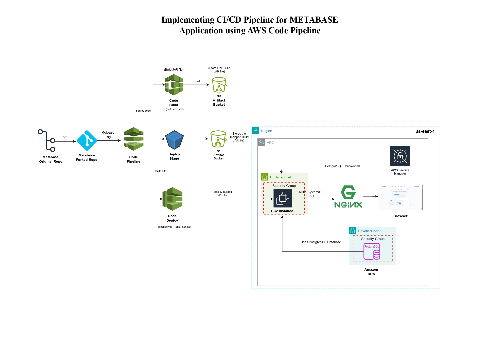

# 🚀 Automated Metabase CI/CD Deployment on AWS Cloud

## 📌 Project Overview

This project demonstrates a complete DevOps implementation for deploying the **Metabase Analytics Platform** using a fully automated **CI/CD pipeline on AWS**. The repository is forked from the official Metabase repository and extended to include enterprise-grade cloud infrastructure, automation, security, and deployment workflows.

The focus of this project is not application development, but **DevOps engineering, cloud architecture, automation, and CI/CD pipeline implementation**.


## 🎯 Project Objective

To design and implement a production-grade CI/CD system that:

* Automatically builds Metabase from source
* Packages the application as a JAR
* Stores build artifacts securely
* Deploys the application to EC2
* Integrates PostgreSQL as metadata storage
* Secures credentials using Secrets Manager
* Provides scalable, secure cloud architecture


## 🧱 Architecture Overview

### 📊 CI/CD Deployment Flow Diagram



### 🔄 Deployment Flow
GitHub (Forked Repo) → AWS CodePipeline → AWS CodeBuild → S3 Artifact Bucket → AWS CodeDeploy → EC2 Instance → Metabase Application → Amazon RDS (PostgreSQL)

NGINX is used as a reverse proxy with SSL termination for secure browser access.


## ⚙️ Services & Technologies Used

### AWS Services

* AWS CodePipeline (CI/CD Orchestration)
* AWS CodeBuild (Build Automation)
* AWS CodeDeploy (Automated Deployment)
* Amazon EC2 (Application Hosting)
* Amazon S3 (Artifact Storage)
* Amazon RDS (PostgreSQL Database)
* AWS IAM (Access Control)
* AWS Secrets Manager (Credential Management)
* AWS VPC (Network Isolation)
* Security Groups & Subnets

### DevOps & System Tools

* Linux (Ubuntu)
* Bash & Shell Scripting
* systemd
* NGINX
* SSL (Certbot)
* Git & GitHub


## 🔄 CI/CD Pipeline Flow

1. Developer pushes code to forked GitHub repository
2. AWS CodePipeline triggers automatically
3. CodeBuild builds Metabase JAR file
4. Build artifact is stored in S3
5. CodeDeploy pulls artifact
6. Deployment scripts execute on EC2
7. systemd service runs Metabase
8. Application connects to PostgreSQL (RDS)
9. NGINX serves application securely over HTTPS


## 🔐 Security Implementation

* IAM roles with least-privilege access
* Secrets stored in AWS Secrets Manager
* RDS deployed in private subnet
* EC2 access controlled via Security Groups
* VPC network isolation
* SSL encryption using Certbot
* No hardcoded credentials


## 🌐 Network Design

* Custom VPC
* Public Subnet: EC2 + NGINX
* Private Subnet: RDS PostgreSQL
* NAT Gateway for outbound internet access
* Security group-based traffic control


## 📁 Project Structure

```
metabase/
├── .github/                 # GitHub workflows & configurations
├── bin/                     # Utility binaries
├── dev/                     # Development utilities
├── docs/                    # Documentation files
├── e2e/                     # End-to-end tests
├── enterprise/              # Enterprise edition components
├── frontend/                # Frontend source code
├── hooks/                   # Git hooks & automation
├── locales/                 # Language translations
├── modules/                 # Core application modules
├── resources/               # Static resources
├── scripts/                 # Helper scripts
├── src/                     # Backend source code (Clojure)
├── test/                    # Test cases
│
├── buildspec.yml            # AWS CodeBuild configuration
├── appspec.yml              # AWS CodeDeploy configuration
├── Dockerfile               # Container build definition
├── package.json             # Frontend dependencies
├── deps.edn                 # Backend dependencies
├── systemd/                 # Custom systemd service file (added for deployment)
│   └── metabase.service
│
└── README.md                # Project documentation
```


## ⚡ Deployment Automation

* Build automation using CodeBuild
* Artifact management via S3
* Server provisioning using EC2
* Service orchestration using systemd
* Reverse proxy via NGINX
* SSL automation via Certbot
* Database integration with PostgreSQL


## 📊 Monitoring & Reliability

* CloudWatch Logs for build and deploy stages
* CodeDeploy health checks
* systemd auto-restart
* RDS automated backups
* Pipeline failure detection


## 🎓 Learning Outcomes

This project demonstrates practical knowledge in:

* CI/CD pipeline engineering
* Cloud infrastructure design
* DevOps automation
* Secure credential management
* Cloud networking
* Production deployment architecture
* Linux system administration
* Enterprise DevOps workflows


## 🧠 DevOps Concepts Applied

* Infrastructure as a Platform
* Continuous Integration
* Continuous Deployment
* Secure DevOps
* Cloud-native architecture
* Immutable deployments
* Artifact-driven pipelines
* Automated provisioning


## 📌 Use Cases

* DevOps portfolio project
* Cloud engineer demonstration project
* CI/CD learning reference
* Enterprise deployment model
* Production simulation project


## 📜 Attribution

This repository is forked from the official **Metabase** open-source project.

All core application source code belongs to the **Metabase Team**.

This fork is used exclusively for:

* DevOps automation
* CI/CD implementation
* Cloud deployment
* Infrastructure design
* Educational and learning purposes


## 📄 License

Original application license belongs to Metabase.
This repository follows the same open-source license terms.


## 👨‍💻 Author

Project implemented as a DevOps learning and portfolio project demonstrating real-world cloud CI/CD practices.
